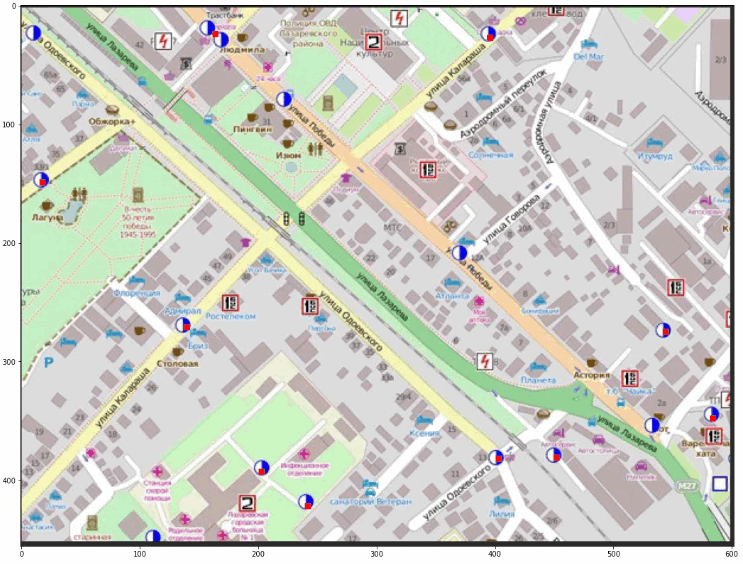

# Портфолио разработчика: Малютин Олег Сергеевич

## Общий список проектов:

**IT Проекты:**
1.	ГраФиС-Тактик (Visio, VBA)
2.	Генезис (Python, GIS)
3.  Автоматическое составление планшета источников противопожарного водоснабжения (Python, Tensorflow)
3.	Плагин для 2ГИС EWS (Delphi, MS Access)
3.  Плагин для 2ГИС "Оперативно-тактические характеристики зданий и сооружений" (Delphi, MS Access)
4.	Кросс-платформенное приложение в AR для поиска гидрантов (C#, Unity)
5.	YouTube-канал Vigil-IT video
6.	Набор SVG для пожарной охраны (SVG)
7.	Калькулятор ГДЗС (html/css/js, Cordova.js)
9.	Справочник по выездке (html/css/js, Ionic.js)
10.	Программный комплекс Карта пожарного (html/css/js, Cordova.js, Firebase)
11.	Программный комплекс Трекер пожарного (html/css/js, Cordova.js, Firebase)
12.	Система планирования работ НТЦ (html/css/js, Firebase)
13.	wiki-fire.org (html/css/js, screw-turn wiki)
14.	База данных Кадры (MS Access, VBA)
15.	База данных Пожары для Красноярска (MS Access, VBA)
16.	База данных Пожары для Владимира (MS Access, VBA)
17.	Система составления расписаний для подразделений пожарной охраны (MS Access, VBA)
1.	СОИСПОЛНИТЕЛЬ: Мобильные кросс-платформенные приложения "Справочник НКПЧ" и "Справочник дознавателя" (Cordova.js)

**Инженерно-технические проекты:**
1.  Расчет численности и оптимальных мест размещения пожарно-спасательных подразделений на территории города Красноярска (Geodata-science, Python)
2.  СОИСПОЛНИТЕЛЬ: Расчет численности и оптимальных мест размещения пожарно-спасательных подразделений на территории Регионов РФ (Geodata-science, Python)
3.  СОИСПОЛНИТЕЛЬ+TEAM-LEAD: Анализ пожарной опасности объектов защиты АО «К» (*название изменено*) и разработка расчет-обоснования необходимых сил и средств объектовой пожарной охраны (а также мест их дислокации), для тушения возможных пожаров и проведения аварийно-спасательных работ (АСР), на объектах защиты АО «К» (Руководство командой, Нормативка, Составление ТЗ, Python)

> Все сведения приведенные в данном документе относятся к работе выполненной именно мной. Работы к выполнению которых я отношения не имел здесь не указаны! В случае чужих работ в которых я принимал участие как соисполнитель это указывается явным образом с указанием конкретных задач.

# ГраФиС-Тактик

**Стек**: `VBA`, `MS Visio`, `MS Access`, `SQL`, `html/css/js`, `VSTO`

Автоматизированная информационно-графическая система ГраФиС-Тактик это мой ключевой, самый любимый и самый развитый проект, хотя и написанный на устаревшей уже технологической базе. Работа отмечалась наградами за лучшую научно-исследовательскую работу.

## Краткое описание

АИГС ГраФиС-Тактик - это набор трафаретов для приложения MS Visio, предназначенный для автоматизации составления схем расстановки сил и средств при тушении пожаров и проведения расчета сил и средств. 

**В рамках работы**:
- разработан набор из более чем 150 условных графических элементов отражающих объекты пожарной охраны (пожарная техника, стволы, личный состав, элементы управления, подписи и т.д.), наделенные собственной логикой и связью с базой данных ТТХ
- разработан алгоритм построения площади пожара для произвольной формы ограждающих конструкций, основанный на тактической модели расчета и клеточном разбиении пространства
- разработан алгоритм гидравлического расчета сложных насосно-рукавных систем
- разработана система анализа схем расстановки сил и средств
- разработана и наполнена база данных ТТХ пожарной техники
- разработан официальный сайт проекта
- разработана система построения отчетов в формате страниц html
- разработана методика применения системы в деятельности пожарной охраны
- для поддержки системы организована группа ВКонтакте
- разработана надстройка MS Visio позволяющая автоматически строить карты местности на основе данных OSM
- разработана система транслирования обстановки на удаленные терминалы, в том числе с использованием координат GSM
- разработано программное ядро динамического моделирования боевых действий
- на компоненты системы в общей сложности получено 12 свидетельств о государственной регистрации ЭВМ и БД
- по итогам разработки системы опубликовано более 10 публикаций в научных изданиях, в том числе 6 в журналах из перечня ВАК

**Сайт проекта**: https://www.graphicalfiresets.ru/

**ВКонтакте**: https://vk.com/aigs_grafis

  
Полное описание проекта

Проект включает в себя 12 основных трафаретов и 14 дополнительных.

Он позволяет решать обширный круг задач связанных с пожарной тактикой:

-	Составлять интерактивные схемы расстановки боевых действий;
-	Проводить обширный перечень пожарно-тактических расчетов:
    -	определять путь, пройденный огнем и форму пожара
    -	рассчитывать основные параметры пожара
    -	вычислять требуемое количество сил и средств для тушения пожара
    -	рассчитывать параметры насосно-рукавных систем любой сложности
    -	обобщать и визуализировать в различных формах информацию о сложившейся пожарно-тактической обстановке на месте пожара
-	Визуализировать результаты расчета и текущее состояние пожарно-тактической обстановки в виде таблиц, отчетных форм, графиков и диаграмм
-	Автоматически составлять в формате Word карточки боевых действий и донесения о пожаре на основе данных указанных в схемах расстановки
-	Вести и редактировать базу данных пожарно-технической информации, используемой при составлении моделей
-	Загружать карты местности на основе данных OSM

## Подпроекты

### База данных

**Стек**: `VBA`, `MS Access`

База данных ТТХ пожарной техники и основных справочных данных по пожарам, разработана с использованием СУБД Access.

### Сайт проекта

**Стек**: `ASP MVC`, `C#`, `html/css/js`, `bootstrap`, `jquery`, `SQL Server`

 

Сайт проекта разработан с использованием фреймворка `ASP MVC`, имеет админскую область, использует базу данных `SQL Server`. Предназначен для размещения, новостей о проекте, справочных данных, примеров использования системы и контактов разработчика.

# Программный комплекс по расчетному обоснованию мест дислокации пожарных подразделений Генезис

**Стек**: `Python`, `osmnx`, `networkx`, `nltk`, `fuzzywuzzy`, `geopandas`, `pytest`, `OSM`, `QGIS`, `PyQT`, `Quarto`, `osmosis`

**Алгоритмы и задачи**: `MCLP`, `LSCP`, `KDE`, `GA`, `SAA`, `ABC`, `MSA`, `HC`, `SHC`

Предназначен для решения задач поиска оптимального размещения подразделений пожарной охраны и границ районов выезда. В настоящее время внедрен в деятельность МЧС России и используется для расчетного обоснования численности и мест дислокации вновь создаваемых пожарных подразделений.

**В рамках работы**:
-	разработал принципиально новый *модульный подход к гибридизации эвристических алгоритмов* для решения задач оптимального размещения на графах (`MCLP`, `LSCP`) 
-	разработал *авторский алгоритм* решения задач оптимального размещения, основанный на аналогии с генезисом живых организмов
-	предложил *математическую модель* оценки спроса на пожарные подразделения
-	впервые применил *метаэвристические алгоритмы* оптимизации и методы линейной регрессии для оценки скоростей следования пожарных автомобилей по разным типам дорог, а также для подбора констант модели прогнозирования ожидаемой плотности потока пожаров на различных участках города в зависимости от характера городской застройки
-	для верификации предложенных методов спланировал и провел серию вычислительных экспериментов для различных городов и наборов данных
-	подготовил датасеты о плотностях пожаров, графах улично-дорожной сети и городской застройке, в том числе с использованием `nltk` для подготовки данных об адресах зданий перед геокодированием

# Применение сверточных нейронных сетей для распознавание изображений источников наружного противопожарного водоснабжения на сканах планшетов водоисточников

**Стек**: `Tensorflow`, `Python`, `jupiter`, `numpy`, `CV`, `leaflet.js`

Поиск отметок источников наружного противопожарного водоснабжения на сканах карты, их идентификация и сопоставление с географическими координатами для последующего формирования базы данных.

Проект выполнен в рамках освоения программы обучения «Data Science, нейронные сети, машинное обучение и искусственный интеллект» в Университете Искусственного интеллекта.

**В рамках работы**:
* Разработал 3 уровневую каскадную CNN-модель для распознавания меток пожарных гидрантов (и прочих условных обозначений) на сканах планшетов водоисточников их сегментации и классификации
* Подготовил обучающий датасет с использованием аугментации имеющихся и синтезированных сканов ИНППВ
* Рассмотрел различные архитектуры нейронных сетей, выбрал наилучшую
* Написал итоговое решение для автоматизации составления баз данных ИНППВ с географической привязкой и визуализацией в виде интерактивной карты leaflet

[Репозиторий GitHub](https://github.com/Obsidian-pb/INPPW_recognition_ML)

  
Дополнительные изображения

  
  Фрагменты скана с нанесенными ИНППВ:

  

  Результаты распознавания образа исходных фрагментов для подачи в модель интерпретации и размещения:

  

  Результаты классификации объектов:

  

# Плагин для 2ГИС EWS

**Стек**: `2GIS API`, `Delphi`, `MS Access`, `RAD Studio`, `html`

Плагин для программы 2ГИС позволяющий вести учет объектов наружного противопожарного водоснабжения расположенных в районе выезда пожарно-спасательного подразделения.

Плагин позволяет:

* размещать на карте 2ГИС условные обозначения источников наружного противопожарного водоснабжения
* вести учет состояния источников наружного противопожарного водоснабжения

**В рамках работы**:
* Разработан плагин для 2ГИС с использованием API настольной версии приложения
* Разработана база данных водоисточников
* Разработана логика экспорта данных в различные форматы (kml, kmz, xml)

  
Дополнительные изображения

  

  

**Скачать**: https://cloud.mail.ru/public/grhW/KS2qNEStD

# Плагин для 2ГИС "Оперативно-тактические характеристики зданий и сооружений"

**Стек**: `2GIS API`, `Delphi`, `MS Access`, `RAD Studio`, `MS Excel`, `html`

Плагин для программы 2ГИС позволяющий вести учет оперативно-тактических характеристик объектов расположенных в районе выезда пожарно-спасательного подразделения.

Плагин позволяет дополнять основные сведения 2ГИС информацией об оперативно-тактических характеристиках зданий в районе выезда

**В рамках работы**:
* Разработан плагин для 2ГИС с использованием API настольной версии приложения
* Разработана база данных объектов
* Разработана логика импорта/экспорта данных между различными экземплярами БД

  
Дополнительные изображения

  

  

**Скачать**: https://cloud.mail.ru/public/4kB5/4ttdoohtX

# Мобильное кросс-платформенное приложение в AR для поиска гидрантов

**Стек**: `C#`, `Unity`, `Android Studio`, `X Project`

Предложение предназначено для упрощения процесса поиска пожарных гидрантов пожарными подразделениями при тушении пожаров, особенно в зимнее время, под слоем снега. К сожалению в силу ряда как технических, так и организационных причин, до реального применения приложения в подразделениях не дошло, однако опыт был очень интересный.

<iframe src="https://vk.com/video_ext.php?oid=-83493078&id=456239082&hd=2&autoplay=1" width="400" height="260" allow="autoplay; encrypted-media; fullscreen; picture-in-picture; screen-wake-lock;" frameborder="0" allowfullscreen></iframe>

**В рамках работы**:
* Разработана логика и архитектура приложения
* Разработана логика взаимодействия с удаленной базой данных ИНППВ (написана не мной, параллельно)
* Скомпилированы проекты для Android и IOS
* Опубликованы в магазинах приложений (в настоящее время удалены)

# YouTube-канал Vigil-IT video

В качестве одного из своих любимых проектов хочется привести канал [Vigil-IT video](https://youtube.com/@vigilit-video1765). Прямого отношения к программированию он не имеет, однако позволяет оценить меня со стороны ментора.

Канал предназначен для популяризации информационных технологий среди пожарных РФ. Здесь я выкладываю видео посвященные вопросам автоматизации и упрощения повседневных рутинных задач деятельности сотрудников пожарной охраны - документооборота, проведения пожарно-тактических расчетов, ведения баз данных и так далее. Рассказывается о таких направлениях как Visio, Access, Word, Excel, VBA, ГИС.

Сейчас на канале свыше **200 видеороликов** и **14,7 тыс. подписчиков**.

