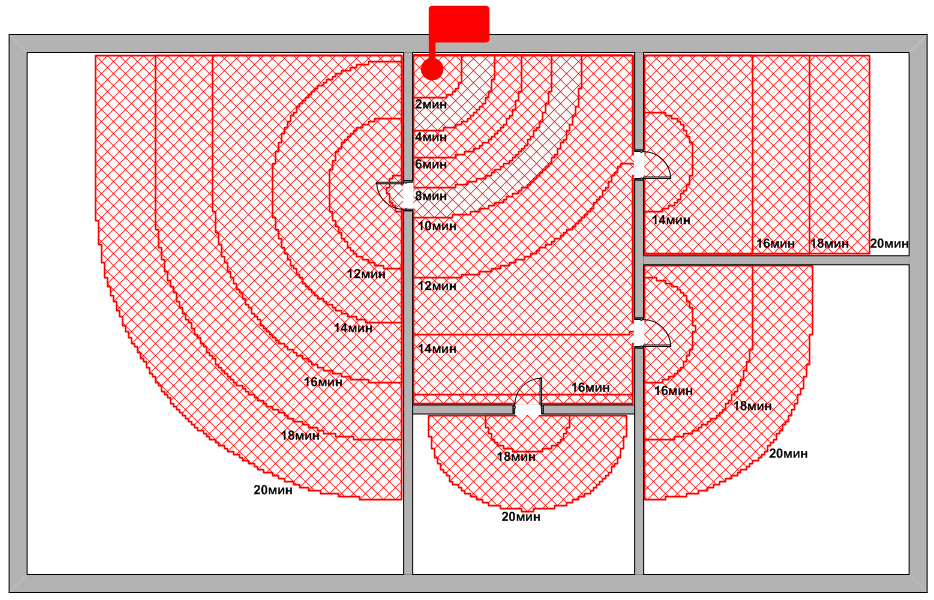
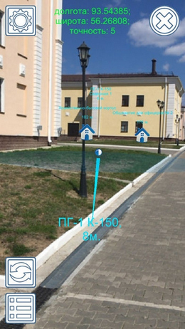

# Портфолио разработчика: Малютин Олег Сергеевич

## Общий список проектов:

**IT Проекты:**
1.	ГраФиС-Тактик (Visio, VBA, MS Access)
2.	Генезис (Python, GIS)
3.  Автоматическое составление планшета источников противопожарного водоснабжения (Python, Tensorflow)
3.	Плагин для 2ГИС EWS (Delphi, MS Access)
3.  Плагин для 2ГИС "Оперативно-тактические характеристики зданий и сооружений" (Delphi, MS Access)
4.	Мобильное кроссплатформенное приложение с AR для поиска гидрантов (C#, Unity)
5.	YouTube-канал Vigil-IT video
6.	Набор SVG для пожарной охраны (SVG)
7.	Мобильное приложение для Android "Калькулятор ГДЗС" (html/css/js, Cordova.js)
9.	Мобильное приложение для Android "Езды ФКСР" (Справочник по выездке) (html/css/js, Ionic.js)
10.	Программный комплекс Карта пожарного (html/css/js, Cordova.js, Firebase)
11.	Программный комплекс Трекер пожарного (html/css/js, Cordova.js, Firebase)
12.	Система планирования работ НТЦ (html/css/js, Firebase)
13.	wiki-fire.org (html/css/js, screw-turn wiki)
14.	База данных Кадры (MS Access, VBA)
15.	База данных Пожары для Красноярска (MS Access, VBA)
16.	База данных Пожары для Владимира (MS Access, VBA)
17.	Система составления расписаний для подразделений пожарной охраны (MS Access, VBA)
1.	СОИСПОЛНИТЕЛЬ: Мобильные кросс-платформенные приложения "Справочник НКПЧ" и "Справочник дознавателя" (Cordova.js)

**Инженерно-технические проекты:**
1.  Расчет численности и оптимальных мест размещения пожарных подразделений на территории республики Узбекистан (Geodata-science, Python)
2.  Расчет численности и оптимальных мест размещения пожарно-спасательных подразделений на территории города Красноярска (Geodata-science, Python)
3.  СОИСПОЛНИТЕЛЬ: Расчет численности и оптимальных мест размещения пожарно-спасательных подразделений на территории Регионов РФ (Geodata-science, Python)
4.  СОИСПОЛНИТЕЛЬ+TEAM-LEAD: Анализ пожарной опасности объектов защиты АО «К» (*название изменено*) и разработка расчет-обоснования необходимых сил и средств объектовой пожарной охраны (а также мест их дислокации), для тушения возможных пожаров и проведения аварийно-спасательных работ (АСР), на объектах защиты АО «К» (Руководство командой, Нормативка, Составление ТЗ, Python)

> Все сведения приведенные в данном документе относятся к работе выполненной именно мной. В случае работ в которых я принимал участие как соисполнитель, это указывается явным образом с указанием конкретных задач.

# ГраФиС-Тактик

**Стек**: `VBA`, `MS Visio`, `MS Access`, `SQL`, `html/css/js`, `VSTO`

Автоматизированная информационно-графическая система ГраФиС-Тактик это мой ключевой, самый любимый и самый развитый проект, хотя и написанный на устаревшей уже технологической базе. Работа неоднократно отмечалась ведомственными наградами МЧС России.

## Краткое описание

АИГС ГраФиС-Тактик - это набор трафаретов для приложения MS Visio, предназначенный для автоматизации составления схем расстановки сил и средств при тушении пожаров, проведения расчета сил и средств и оформления служебной документации. 

**В рамках работы**:
- разработан набор из более чем 150 фигур условных графических обозначения (УГО) отражающих объекты пожарной охраны (пожарная техника, стволы, личный состав, элементы управления, подписи и т.д.), наделенные собственной логикой и связью с базой данных ТТХ
- разработан алгоритм построения площади пожара для произвольной формы ограждающих конструкций, основанный на тактической модели расчета и клеточном разбиении пространства
- разработан алгоритм гидравлического расчета сложных насосно-рукавных систем
- разработана система анализа схем расстановки сил и средств
- разработана и наполнена база данных ТТХ пожарной техники
- разработан официальный сайт проекта
- разработана система построения отчетов в формате страниц html
- разработана методика применения системы в деятельности пожарной охраны
- для поддержки системы организована группа ВКонтакте
- разработана надстройка MS Visio позволяющая автоматически строить карты местности на основе данных OSM
- разработана система транслирования обстановки на удаленные терминалы, в том числе с использованием координат GSM
- разработано программное ядро динамического моделирования боевых действий
- на компоненты системы в общей сложности получено 12 свидетельств о государственной регистрации ЭВМ и БД
- по итогам разработки системы опубликовано более 10 публикаций в научных изданиях, в том числе 6 в журналах из перечня ВАК

**Сайт проекта**: https://www.graphicalfiresets.ru/

**ВКонтакте**: https://vk.com/aigs_grafis

  
Полное описание проекта

Проект включает в себя 12 основных трафаретов и 14 дополнительных.

Он позволяет решать обширный круг задач связанных с пожарной тактикой:

-	Составлять интерактивные схемы расстановки боевых действий;
-	Проводить обширный перечень пожарно-тактических расчетов:
    -	определять путь, пройденный огнем и форму пожара
    -	рассчитывать основные параметры пожара
    -	вычислять требуемое количество сил и средств для тушения пожара
    -	рассчитывать параметры насосно-рукавных систем любой сложности
    -	обобщать и визуализировать в различных формах информацию о сложившейся пожарно-тактической обстановке на месте пожара
-	Визуализировать результаты расчета и текущее состояние пожарно-тактической обстановки в виде таблиц, отчетных форм, графиков и диаграмм
-	Автоматически составлять в формате Word карточки боевых действий и донесения о пожаре на основе данных указанных в схемах расстановки
-	Вести и редактировать базу данных пожарно-технической информации, используемой при составлении моделей
-	Загружать карты местности на основе данных OSM

## Подпроекты

### База данных

**Стек**: `VBA`, `MS Access`

База данных ТТХ пожарной техники и основных справочных данных по пожарам, разработана с использованием СУБД Access.

### Сайт проекта

**Стек**: `ASP MVC`, `C#`, `html/css/js`, `bootstrap`, `jquery`, `SQL Server`

 

Сайт проекта разработан с использованием фреймворка `ASP MVC`, имеет админскую область, использует базу данных `SQL Server`. Предназначен для размещения, новостей о проекте, справочных данных, примеров использования системы и контактов разработчика.

## Публикации (наиболее интересные)

1. Малютин, О. С. Применение автоматизированной информационно-графической системы ГраФиС-Тактик при подготовке и проведении учения "Безопасная Арктика-2023" / О. С. Малютин // Безопасная Арктика-2023 : Материалы деловой программы Межведомственного опытно-исследовательского учения сил и средств единой государственной системы предупреждения и ликвидации чрезвычайных ситуаций в Арктической зоне Российской Федерации, Арктическая зона Российской Федерации, 06–07 апреля 2023 года. – Москва: ФГБУ ВНИИ ГОЧС (ФЦ), 2023. – С. 164-172. – EDN SVTJQU.(https://www.elibrary.ru/download/elibrary_60007473_23232705.pdf)
2. Компьютерное моделирование боевых действий по тушению пожаров / Ч. В. Чульдум, К. Д. Чабанов, В. В. Рогов, О. С. Малютин // Актуальные проблемы обеспечения пожарной безопасности и защиты от чрезвычайных ситуаций : Сборник материалов Всероссийской научно-практической конференции, Железногорск, 24 апреля 2020 года. – Железногорск: Федеральное государственное бюджетное образовательное учреждение высшего образования "Сибирская пожарно-спасательная академия" Государственной противопожарной службы Министерства Российской Федерации по делам гражданской обороны, чрезвычайным ситуациям и ликвидации стихийных бедствий", 2020. – С. 265-275. – EDN RUQWMH.(https://www.elibrary.ru/download/elibrary_42893535_76561715.pdf)
3. Малютин, О. С. О разработке программного ядра системы динамического моделирования боевых действий по тушению пожаров / О. С. Малютин // Сибирский пожарно-спасательный вестник. – 2020. – № 1(16). – С. 57-63. – DOI 10.34987/vestnik.sibpsa.2020.16.1.009. – EDN SLJLLV.(https://www.elibrary.ru/download/elibrary_42664126_72803017.pdf)
4. Апробация методов компьютерного моделирования при анализе боевых действий по тушению пожаров / О. С. Малютин, С. А. Васильев, Ч. В. Чульдум [и др.] // Сибирский пожарно-спасательный вестник. – 2020. – № 3(18). – С. 75-87. – DOI 10.34987/vestnik.sibpsa.2020.18.3.012. – EDN WTOPGU.(https://www.elibrary.ru/download/elibrary_44022931_64351785.pdf)
5. Малютин, О. С. АИГС ГраФиС как средство повышения скорости и качества разработки отдельных видов документации в подразделениях пожарной охраны / О. С. Малютин // Актуальные проблемы пожарной безопасности : тезисы докладов XXХ Международной научно-практической конференции, Ногинск, 06–08 июня 2018 года. – Ногинск: Всероссийский ордена "Знак Почета" научно-исследовательский институт противопожарной обороны Министерства Российской Федерации по делам гражданской обороны, чрезвычайным ситуациям и ликвидации последствий стихийных бедствий, 2018. – С. 157-160. – EDN YUTJUT.(https://www.elibrary.ru/download/elibrary_36829139_44003732.pdf)

# Программный комплекс по расчетному обоснованию мест дислокации пожарных подразделений Генезис

**Стек**: `Python`, `osmnx`, `networkx`, `nltk`, `fuzzywuzzy`, `geopandas`, `pytest`, `OSM`, `QGIS`, `PyQT`, `Quarto`, `osmosis`

**Алгоритмы и задачи**: `MCLP`, `LSCP`, `KDE`, `GA`, `SAA`, `ABC`, `MSA`, `HC`, `SHC`

Предназначен для решения задач поиска оптимального размещения подразделений пожарной охраны и границ районов выезда. В настоящее время внедрен в деятельность МЧС России и используется для расчетного обоснования численности и мест дислокации вновь создаваемых пожарных подразделений.

## Иллюстрации

Пример анализа параметров прибытия пожарных подразделений:

Пример анализа пространственного распределения плотности пожаров на территории города:

Пример оценки оптимальных мест дислокации новых подразделений:

Пример расчета требуемого количества подразделений для крупного региона:

## В рамках работы:
-	разработал принципиально новый *модульный подход к гибридизации эвристических алгоритмов* для решения задач оптимального размещения на графах (`MCLP`, `LSCP`) 
-	разработал *авторский алгоритм* решения задач оптимального размещения, основанный на аналогии с генезисом живых организмов
-	предложил *математическую модель* оценки спроса на пожарные подразделения
-	впервые применил *метаэвристические алгоритмы* оптимизации и методы линейной регрессии для оценки скоростей следования пожарных автомобилей по разным типам дорог, а также для подбора констант модели прогнозирования ожидаемой плотности потока пожаров на различных участках города в зависимости от характера городской застройки
-	для верификации предложенных методов спланировал и провел серию вычислительных экспериментов для различных городов и наборов данных
-	подготовил датасеты о плотностях пожаров, графах улично-дорожной сети и городской застройке, в том числе с использованием `nltk` для подготовки данных об адресах зданий перед геокодированием
- для геокодирования используются как сервис Яндекс Геокодер, так и собственная разработка.

## Перечень публикаций по результатам работы:

1. Малютин, О. С. Многокритериальная оптимизация размещения пожарно-спасательных подразделений с использованием генетического алгоритма / О. С. Малютин, Р. Ш. Хабибулин // Гибридные и синергетические интеллектуальные системы : сборник статей по материалам научной VII Всероссийской Поспеловской конференции, Калининград, 03–07 июня 2024 года. – Калининград, Санкт-Петербург: Русская христианская гуманитарная академия им. Ф.М. Достоевского, 2024. – С. 287-293. – EDN XPFGAB.(https://www.elibrary.ru/download/elibrary_68529212_10174081.pdf)
2. Малютин, О. С. Корреляционный анализ параметров функционирования пожарно-спасательных подразделений / О. С. Малютин, Р. Ш. Хабибулин // Инженерный вестник Дона. – 2024. – № 3(111). – С. 118-138. – EDN DOFURW.(https://www.elibrary.ru/download/elibrary_67205376_68869912.pdf)
3. Малютин, О. С. Расчет требуемого количества и размещения территориальных подразделений пожарной охраны с учетом требований действующего законодательства Российской Федерации / О. С. Малютин // Актуальные проблемы пожарной безопасности : материалы XXXV Международной научно-практической конференции, Москва, 31 мая 2023 года. – Москва: Всероссийский ордена "Знак Почета" научно-исследовательский институт противопожарной обороны Министерства Российской Федерации по делам гражданской обороны, чрезвычайным ситуациям и ликвидации последствий стихийных бедствий, 2023. – С. 11-18. – EDN AISUBI.(https://www.elibrary.ru/download/elibrary_53933558_50757577.pdf)
4. Бабенышев, С. В. Некоторые вопросы статистики пожаров в Российской Федерации / С. В. Бабенышев, Е. Н. Матеров, О. С. Малютин // Актуальные проблемы обеспечения пожарной безопасности и защиты от чрезвычайных ситуаций : Материалы IV Всероссийской научно-практической конференции, Красноярск, 21 апреля 2023 года. – Железногорск: Федеральное государственное бюджетное образовательное учреждение высшего образования "Сибирская пожарно-спасательная академия" Государственной противопожарной службы Министерства Российской Федерации по делам гражданской обороны, чрезвычайным ситуациям и ликвидации стихийных бедствий", 2023. – С. 29-32. – EDN ILQJJM.(https://www.elibrary.ru/download/elibrary_54069807_11253487.pdf)
5. Малютин, О. С. Анализ суточного изменения скоростей движения пожарных автомобилей для определения мест оптимального размещения подразделений ГПС / О. С. Малютин, Р. Ш. Хабибулин // Академия Государственной противопожарной службы МЧС России: Теория. Инновации. Практика : Материалы научно-практической конференции с международным участием, посвященной 90-летию со дня образования Академии ГПС МЧС России. В 5-ти частях, Москва, 19 октября 2023 года. – Москва: Академия Государственной противопожарной службы, 2023. – С. 52-60. – EDN UOBIEV.(https://www.elibrary.ru/download/elibrary_65428106_52139108.pdf)
6. Бабенышев, С. В. Анализ статистических данных по прибытию пожарно-спасательных подразделений на пожары за период с 2010 по 2020 год в Российской Федерации / С. В. Бабенышев, О. С. Малютин, Е. Н. Матеров // Современные проблемы обеспечения безопасности : Сборник материалов XXV Международной научно-практической конференции, Екатеринбург, 26–27 апреля 2023 года. – Екатеринбург: Уральский институт Государственной противопожарной службы МЧС России, 2023. – С. 93-96. – EDN JZHUUL.(https://www.elibrary.ru/download/elibrary_54815996_10211160.pdf)
7. Малютин, О. С. Обзор подходов, методов и алгоритмов обоснования управленческих решений по снижению времени прибытия подразделений пожарной охраны к месту вызова / О. С. Малютин, Р. Ш. Хабибулин // Пожаровзрывобезопасность. – 2023. – Т. 32, № 5. – С. 60-77. – DOI 10.22227/0869-7493.2023.32.05.60-77. – EDN KYKUYU.(https://www.elibrary.ru/download/elibrary_54780783_91268288.pdf)

# Применение сверточных нейронных сетей для распознавание изображений источников наружного противопожарного водоснабжения на сканах планшетов водоисточников

**Стек**: `Tensorflow`, `Python`, `jupiter`, `numpy`, `CV`, `leaflet.js`

Поиск отметок источников наружного противопожарного водоснабжения на сканах карты, их идентификация и сопоставление с географическими координатами для последующего формирования базы данных.

Проект выполнен в рамках освоения программы обучения «Data Science, нейронные сети, машинное обучение и искусственный интеллект» в Университете Искусственного интеллекта.

**В рамках работы**:
* Разработал 3 уровневую каскадную CNN-модель для распознавания меток пожарных гидрантов (и прочих условных обозначений) на сканах планшетов водоисточников их сегментации и классификации
* Подготовил обучающий датасет с использованием аугментации имеющихся и синтезированных сканов ИНППВ
* Рассмотрел различные архитектуры нейронных сетей, выбрал наилучшую
* Написал итоговое решение для автоматизации составления баз данных ИНППВ с географической привязкой и визуализацией в виде интерактивной карты leaflet

[Репозиторий GitHub](https://github.com/Obsidian-pb/INPPW_recognition_ML)

  
Дополнительные изображения

  
  Фрагменты скана с нанесенными ИНППВ:

  

  Результаты распознавания образа исходных фрагментов для подачи в модель интерпретации и размещения:

  

  Результаты классификации объектов:

  

# Плагин для 2ГИС EWS

**Стек**: `2GIS API`, `Delphi`, `MS Access`, `RAD Studio`, `html`

Плагин для программы 2ГИС позволяющий вести учет объектов наружного противопожарного водоснабжения расположенных в районе выезда пожарно-спасательного подразделения.

Плагин позволяет:

* размещать на карте 2ГИС условные обозначения источников наружного противопожарного водоснабжения
* вести учет состояния источников наружного противопожарного водоснабжения

**В рамках работы**:
* Разработан плагин для 2ГИС с использованием API настольной версии приложения
* Разработана база данных водоисточников
* Разработана логика экспорта данных в различные форматы (kml, kmz, xml)

  
Дополнительные изображения

  

  

**Скачать**: https://cloud.mail.ru/public/grhW/KS2qNEStD

# Плагин для 2ГИС "Оперативно-тактические характеристики зданий и сооружений"

**Стек**: `2GIS API`, `Delphi`, `MS Access`, `RAD Studio`, `MS Excel`, `html`

Плагин для программы 2ГИС позволяющий вести учет оперативно-тактических характеристик объектов расположенных в районе выезда пожарно-спасательного подразделения.

Плагин позволяет дополнять основные сведения 2ГИС информацией об оперативно-тактических характеристиках зданий в районе выезда

**В рамках работы**:
* Разработан плагин для 2ГИС с использованием API настольной версии приложения
* Разработана база данных объектов
* Разработана логика импорта/экспорта данных между различными экземплярами БД

  
Дополнительные изображения

  

  

**Скачать**: https://cloud.mail.ru/public/4kB5/4ttdoohtX

# Мобильное кросс-платформенное приложение с AR для поиска гидрантов

**Стек**: `C#`, `Unity`, `Android Studio`, `Xcode`

Предложение предназначено для упрощения процесса поиска пожарных гидрантов пожарными подразделениями при тушении пожаров, особенно в зимнее время, под слоем снега. К сожалению в силу ряда как технических, так и организационных причин, до реального применения приложения в подразделениях не дошло, однако опыт был очень интересный.

[Ролик о работе приложения>>](https://vk.com/video_ext.php?oid=-83493078&id=456239082&hd=2&autoplay=0)

  
Изображения

  Пример экрана смартфона с изображением с камеры и наложенными поверх метками ИНППВ:

  

  То же самое, но с дополнительной информацией:

  

**В рамках работы**:
* Разработана логика и архитектура приложения
* Разработана логика взаимодействия с удаленной базой данных ИНППВ (написана не мной, параллельно)
* Скомпилированы проекты для Android и IOS
* Опубликованы в магазинах приложений (в настоящее время удалены)

# YouTube-канал Vigil-IT video

В качестве одного из своих любимых проектов хочется привести канал [Vigil-IT video](https://youtube.com/@vigilit-video1765). Прямого отношения к программированию он не имеет, однако позволяет оценить меня со стороны ментора.

Канал предназначен для популяризации информационных технологий среди пожарных РФ. Здесь я выкладываю видео посвященные вопросам автоматизации и упрощения повседневных рутинных задач деятельности сотрудников пожарной охраны - документооборота, проведения пожарно-тактических расчетов, ведения баз данных и так далее. Рассказывается о таких направлениях как Visio, Access, Word, Excel, VBA, ГИС.

Сейчас на канале свыше **200 видеороликов** и **14,7 тыс. подписчиков**.

# Набор SVG для пожарной охраны (SVG)

**Стек**: `SVG`, `VSC`

Набор векторных изображений в формате svg для использования в пожарной охране России. Векторные изображения основаны на представлении условных графических обозначений пожарной техники, оборудования и элементов пожарно-тактической обстановки используемых в [АИГС ГраФиС-Тактик](https://graphicalfiresets.ru).

**В рамках работы**:
* Подготовлены правила разработки обозначений
* Разработаны сами обозначения

**Ссылка**: https://github.com/Obsidian-pb/GraFiS_svg

# Мобильное приложение для Android "Калькулятор ГДЗС"

**Стек**: `html/css/js`, `Cordova.js`

Приложение предназначено для автоматизации проведения расчетов времени работы в средствах индивидуальной защиты органов дыхания. Написано с использованием фреймворка Cordova.js. Распространение осуществлялось путем непосредственной передачи apk пользователям.

**В рамках работы**:
* Разработано веб-приложение с логикой проведения расчетов на Java script
* С использованием Cordova.js сформирован проект приложения Android, скомпилирован apk файл.

**Ссылка**: https://wiki-fire.org/public/gdzs/calc.html (веб-размещение)

# Мобильное приложение для Android "Езды ФКСР" (Справочник по выездке)

**Стек**: `html/css/js`, `Ionic.js`, `RuStore`

Приложение содержит перечень и описание езд (тестов) по дисциплине конного спорта "Выездка".

**В рамках работы**:
* Разработано веб-приложение с использованием фреймворка `Ionic.js`
* Сформирован проект приложения Android
* Приложение размещено на сервисе `RuStore`

**Ссылка**: [Страница на сайте RuStore](https://www.rustore.ru/catalog/app/io.ionic.starter)

# Программный комплекс Карта пожарного 

**Стек**: `html/css/js`, `Cordova.js`, `Firebase`, `SQLite`, `Leaflet`

Небольшой набор простеньких решений написанных для апробации в рамках учений "Безопасная Арктика 2021". Предназначен для составления, ведения и предоставления при тушении пожаров информации о источниках наружного противопожарного водоснабжения. Включает в себя:

**В рамках работы разработаны**:

1. Менеджер данных, предназначенное для редактирования базы данных. Веб-приложение для локального использования
2. Клиентское веб-приложение для просмотра данных на настольных ПК. Веб-приложение для глобального доступа через Интерент
3. Приложение для просмотра данных на мобильных устройствах. Мобильное приложение для Android написанное на **Cordova.js**

Основной фишкой мобильного приложения и менеджера данных является возможность автономной работы, при отсутствии доступа в Интернет, что продиктовано условиями работы пожарной охраны. Вся информация хранится локально в базах данных **SQLite**. Фактически доступ к сети требуется только для обновления информации. Удаленное хранение информации реализовано с использованием облачной **NoSQL** БД **Firebase**. В качестве картографической библиотеки использована **Leaflet.js**.

# Программный комплекс Трекер пожарного

**Стек**: `html/css/js`, `Cordova.js`, `Firebase`, `Leaflet`, `GPS-геолокация`

Еще одно решение написанное для учений "Безопасная Арктика 2021". Предназначено для отслеживания пространственного положения пожарных и пожарной техники на месте пожара. Представляет собой мобильные приложения для пожарных которые с некоторой периодичностью передают на сервер сведения о GPS-координатах владельца. Диспетчер пожарного подразделения и руководство пожарной охраны могут в реальном времени отслеживать положение личного состава и техники.

В качестве серверной части использована облачная **NoSQL** БД **Firebase**. За счет этого же реализована возможность отслеживать в реальном времени изменения в записях о координатах пользователей.

Система состоит из двух приложений:

1. Персональный трекер пожарного. Мобильное приложение для Android написанное на **Cordova.js**
2. Веб-приложение для визуализации положения пользователей на местности.

Мобильное приложение по сути представляет собой единственный экран, нажатием на который пользователь запускает процесс отслеживания. Повторное нажатие прекращает отслеживание.

Веб приложение для отслеживания использует картографическую библиотеку **Leaflet.js**. Для получения данных  используются библиотеки **Firebase**. Связывание происходит по принципу сокетов, что позволяет обновлять положение маркеров на карте в реальном времени.

Визуализация положения:

Мобильное приложение - Трекер:

Применение в ходе учений:

# Система планирования работ НТЦ

**Стек**: `html/css/js`, `Firebase`

Небольшое6 веб-приложение предназначенное дял внутреннего пользования сотрудников научно-технического центра по организации совместной работы. В целом похоже на доску Канбан с совместным доступом. Фронтенд реализован на базе `html/css/js`, в качестве бэкенда выступает база данных Google `Firebase`, что позволило отслеживать любые внесенные изменения в реальном времени.

Редактирование задачи:

Общий вид:

# Расчет численности и оптимальных мест размещения пожарных подразделений на территории республики Узбекистан 

**Стек**: Python, geopandas, osmnx, GA, MSA, Оптимизация размещения

Проект выполнялся в индивидуальном порядке.

---

> Наполнение продолжается. Если вас заинтересовал какой-то из проектов, которых еще нет в портфолио (или есть) вы можете написать мне лично (obsidian-pb@mail.ru) и попросить рассказать о нем поподробнее.